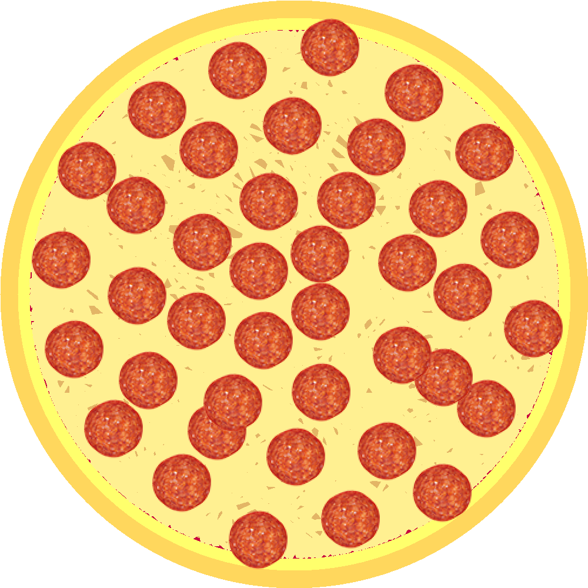
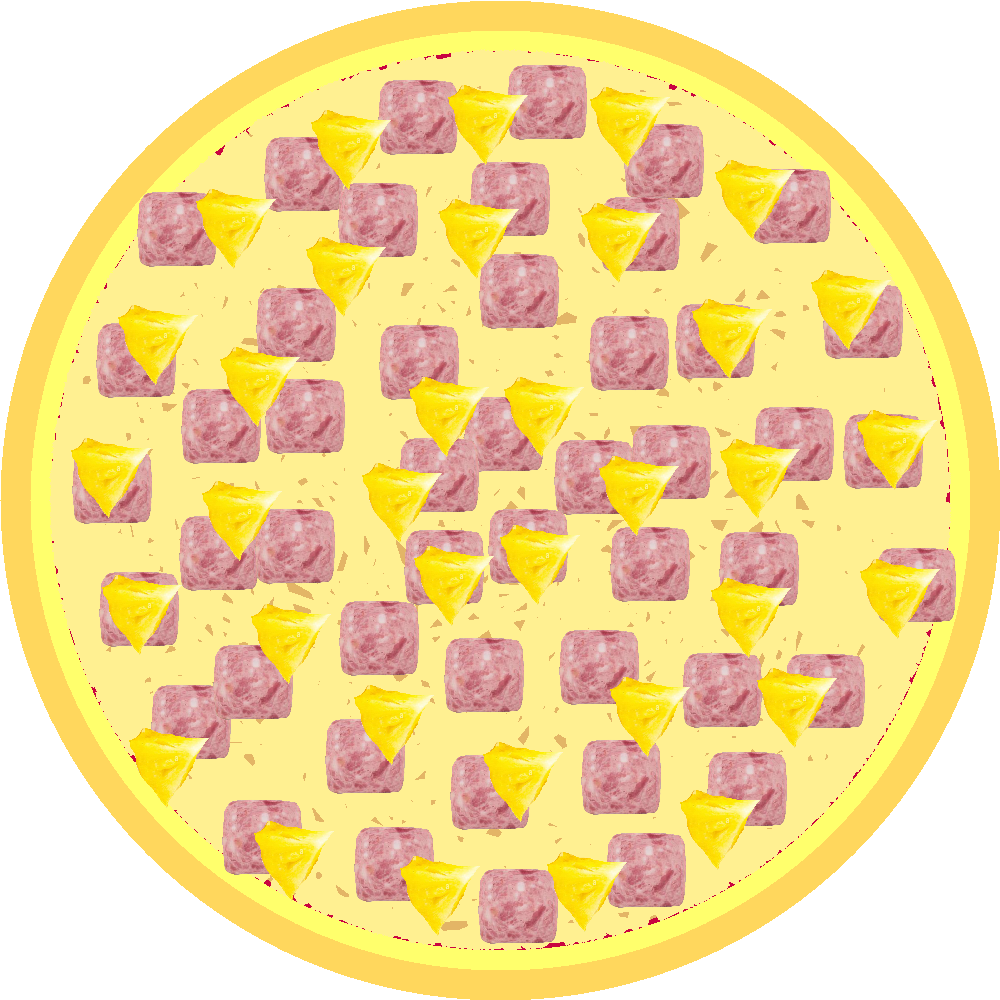

# 🍕 Pizza Compiler

Un compilador básico que te permite ¡preparar pizzas con los ingredientes que tú quieras!
Fue desarrollado para la materia de compiladores de la licenciatura en desarrollo y tecnologías
de software de la Universidad Autónoma de Chiapas (UNACH).

---

## 📖 Tabla de contenido

- [Descripción](#-descripción)
- [Características](#-características)
- [Instalación](#-instalación)
- [Uso](#-uso)
- [Estructura del lenguaje](#-estructura-del-lenguaje)
- [Ejemplos](#-ejemplos)
- [Anexos](#-anexos)
- [Contacto](#-contacto)

---

## 📝 Descripción

PizzaLang es un lenguaje de programación diseñado para **describir pizzas** de forma declarativa.  
El compilador recibe un código en el lenguaje personalizado PizzaLang y como resultado
te entrega las pizzas que preparaste en el formato de imagén que tú desees.

---

## ✨ Características

- Sintaxis sencilla para definir pizzas.
- Permite definir ingredientes personalizados, y a agruparlos en especialidades.
- Genera una imagén de la pizza que creaste como salida y la guarda con el nombre y dónde tú gustes.
- Manejo básico de estructuras, tokenization, parsing y semántica.
- Permite importar código de otro PizzaFile.

---

## ⚙️ Instalación

Clona el repositorio:

```bash
git clone https://github.com/tuusuario/pizzalang.git
cd pizzalang
```

### Requerimientos

Vas a necesitar tener instalado:

- Java 17 o superior
- Maven

---

## 🚀 Uso

Si usas un IDE compatible con Maven, puedes abrir el proyecto y ejecutar la clase **Main**
directamente, sin necesidad de usar la línea de comandos.

### 1. Compilar el proyecto

```bash
mvn clean install
```

### 2. Compilar tu código

Usando java:

```bash
java -jar target/pizza-compiler-1.0-SNAPSHOT.jar [ruta-al-código]
```

Usando Maven:

```bash
mvn exec:java -Dexec.mainClass="Main" [ruta-al-código]
```

### 3. Parámetros del compilador

El compilador puede recibir parámetros extra que pueden ser útiles.

|         Parámetro          | Descripción                                  |
|:--------------------------:|----------------------------------------------|
|    `-s` / `--show-mode`    | Muestra el proceso de compilación en consola |
| `-i` / `--image-extension` | Cambia la extensión de la imagén de salida   |

---

## 🧩 Estructura del Lenguaje

PizzaLang es un lenguaje estructurado en el que puedes definir dos distintos
tipos de variables globales, ingredientes y especialidades.

No es **case sensitive**, pero yo suelo poner en mayúscula todo aquello que no sea una
palabra reservada.

### Palabras reservadas

| Descripción            | Palabra                          |
|:-----------------------|:---------------------------------|
| Tipos                  | `INGREDIENT` `SPECIALTY` `PIZZA` |
| Declarativos           | `IMPORT` `DEFINE` `MAKE`         |
| Operadores de pizza    | `PERSONAL` `MEDIUM` `BIG`        |
| Operadores de adición  | `ADD` `OF` `AND`                 |
| Operadores aritméticos | `*` `/` `+` `-`                  |
| Otros                  | `RESIZE` `SAVE` `AS`             |

### Tipos primitivos

El compilador cuenta con soporte para números, cadenas y sus dos tipos personalizados `INGREDIENT` y
`SPECIALTY`. Para los números, basta con solo usar un número del 0 al 9, o una operación aritmética
válida; para las cadenas, se deben cerrar entre comillas simples.

### Declaración de tipos

Para decirle al compilador que quieres definir un nuevo tipo se utiliza la palabra `DEFINE`
seguido de alguno de los tipos, a excepción de `PIZZA` el cual no cuenta con soporte actualmente.

Si vas a definir un `INGREDIENT`, solo debes añadir una ruta local o web válida para que la pueda
usar como imagén, en caso de que quieras cambiar su tamaño con respecto a la pizza, puedes usar
el operador `RESIZE` seguido del tamaño en píxeles; considera que el tamaño de las pizzas según
si son `BIG`, `MEDIUM` o `PERSONAL` las cuales tiene un radio de 150, 300 y 500 píxeles respectivamente.

Para una `SPECIALTY`, la sintaxis cambia un poco, se abren llaves y dentro de ellas se incluyen los
`INGREDIENT` que quieres utilizar para la especialidad, deben estar previamente definidos y además
debes incluir la cantidad que quieras usar.

### Creación de la pizza

Para crear una pizza, previamente debes tener variables de tipo `INGREDIENT` o `SPECIALTY` definidas,
si no los tienes, puedes importar la librería base donde yo mismo defino varios ingredientes y
especialidades comunes.

Primero hay que usar la palabra reservada `MAKE` para informar que quieres crear una pizza, luego se debe
especificar el tamaño de la pizza, e inmediatamente la palabra `PIZZA`. Después, si quieres añadir un
ingrediente, debes especificarlo con la palabra `ADD`, y si es una especialidad, debes usar `OF`; en caso
de que quieras combinar más de un ingrediente o especialidad, puedes encadenarlos usando `AND`.

Por último, el compilador siempre va a guardar tu pizza con el nombre pizza[n_pizza], si quieres otro
nombre, puedes usar las palabras `SAVE` `AS` y luego como entre comillas simples le dices el nombre
con el que quieres que se guarde.

###

---

## 🍕 Ejemplos

Crea una pizza de pepperoni y hawaiana:

```pizzalang
include 'basicmenu';

make big pizza add PEPPERONI(25);
make big pizza of HAWAIANA;
```

Crea un ingrediente y especialidad personalizable:

```pizzalang
include 'basicmenu';

define ingredient 
    CARROT('https://thumbs.dreamstime.com/b/rebanada-de-la-zanahoria-42069545.jpg?w=768') 
    resize 100;

define specialty CARROT_SOAP {
    PEPPERONI(15);
    CARROT(15);
    ONION(10);
}

make big pizza of CARROT_SOAP;
```

Guarda la pizza que creaste con un nombre personalizado:

```pizzalang
include 'basicmenu';

make big pizza of HONOLULU save as 'mi pizza especial';
```

Estos ejemplos se encuentran en la carpeta examples del proyecto, así como algunos más.

## 🍕 Anexos

<!--suppress HtmlDeprecatedAttribute -->
<div align="center">
    
    <p>Pizza pepperoni</p><br>
    
    <p>Pizza hawaiana</p><br>
    
    <p>Pizza mar y tierra</p>
</div>

## 🔗 Contacto

- GitHub: [kevin-francisco](https://github.com/KevinFranG)
  - LinkedIn: [kevin-a-francisco](https://www.linkedin.com/in/kevin-a-francico)
- Email: kevinfrancisco.dev18@gmail.com
